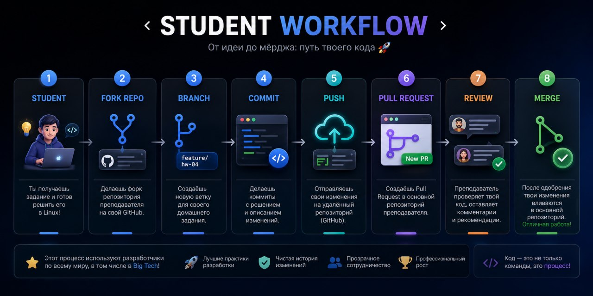

# 🚀 Новый процесс сдачи домашних заданий

> **ВНИМАНИЕ:** Мы переходим на профессиональный GitHub workflow для сдачи домашних заданий.

Этот формат используется в реальных командах разработки (включая Big Tech). Теперь решения сдаются не файлами в чат, а через **GitHub Pull Request**.

---

## Workflow

Весь процесс построен на стандартном цикле разработки:

```
Fork → Clone → Branch → Commit → Push → Pull Request → Code Review → Merge
```

---

## 📝 Пошаговая инструкция

### 1. Сделайте Fork репозитория

Для начала работы сделайте форк (копию) этого репозитория в свой GitHub-аккаунт.

> ➡️ **[Подробная инструкция по Fork и Pull Request](CONTRIBUTING.md)**

### 2. Создайте ветку для задания

Для каждого домашнего задания создавайте отдельную ветку.

**Пример:**
```bash
git checkout -b hw-04-files-ivanov
```

### 3. Выполните задание

В своей ветке добавьте все необходимые файлы с решением:
- Команды
- Результаты выполнения
- Пояснения (если требуются)

### 4. Сохраните и отправьте изменения

Зафиксируйте изменения в коммите и отправьте их в свой форк на GitHub.

```bash
# Добавить все файлы
git add .

# Создать коммит с осмысленным сообщением
git commit -m "HW-04: выполнена работа с файлами"

# Отправить ветку в ваш репозиторий
git push origin hw-04-files-ivanov
```

### 5. Создайте Pull Request (PR)

В интерфейсе GitHub создайте Pull Request из вашей ветки в `main` основного репозитория.

**В описании PR обязательно укажите:**
- Краткое описание решения.
- Структуру созданных файлов.
- Использованные команды.

---

## 🔍 Проверка (Code Review)

Проверка теперь выглядит как в реальной разработке:
- Я оставляю комментарии прямо в коде вашего PR.
- Могу попросить внести исправления или улучшения.
- После всех правок — одобряю (`Approve`) и вливаю (`Merge`) ваше решение.

---

## ⚠️ Важные правила

- ❌ **Больше не сдаём задания в чат.**
- ❌ **Не отправляем скриншоты вместо кода.**
- ❌ **Не делаем `push` напрямую в ветку `main`.**

---

## ✨ Что вы получаете?

Работая по этой схеме, вы учитесь:
- **Работать с Git** на уровне профессиональных разработчиков.
- **Проходить Code Review** — ключевой этап в командной работе.
- **Оформлять свои решения** чисто и понятно.
- **Использовать индустриальный стандарт** разработки ПО.

> P.S. Кто ещё не умеет работать с Git — напишите в ЛС!
